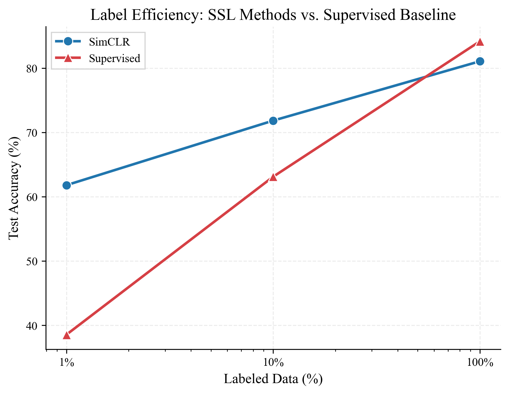
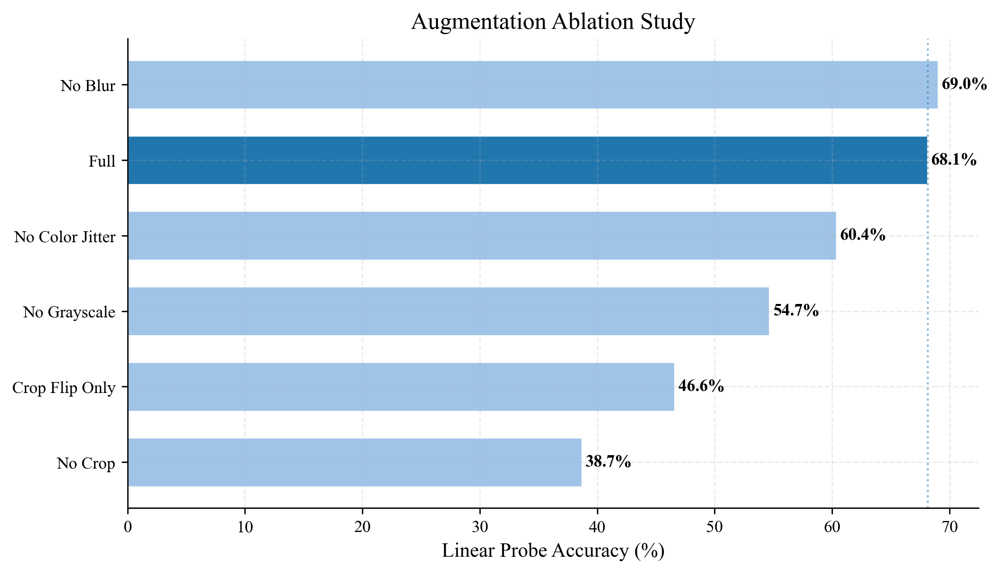
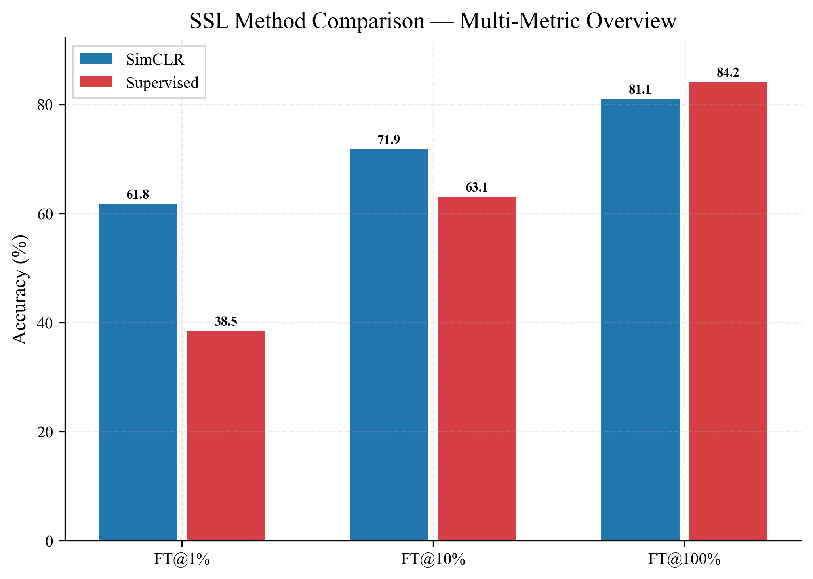
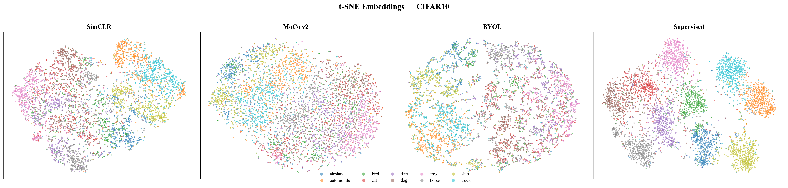
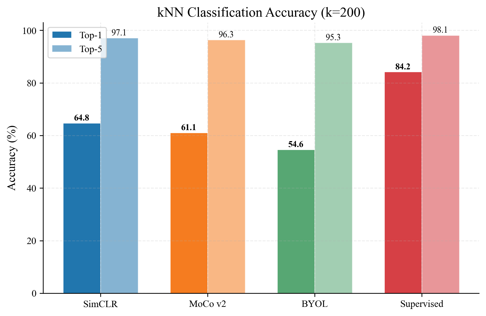
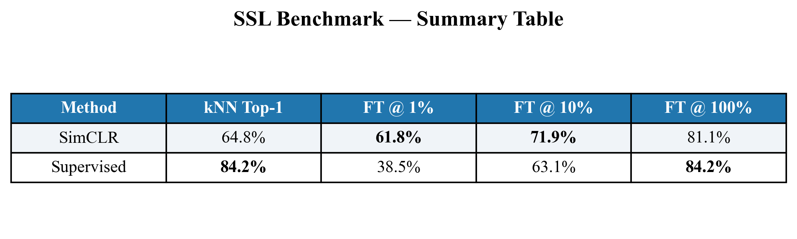

# SimCLR Benchmark — Results Dashboard

*Auto-generated from experiment outputs in `results/`*

---

## 1. Label Efficiency

| Label Fraction | Supervised | SimCLR Fine-Tune | Advantage |
|:-:|:-:|:-:|:-:|
| 1% | 38.5% | 61.8% | +23.3 pp |
| 10% | 63.1% | 71.9% | +8.7 pp |
| 100% | 84.2% | 81.1% | -3.1 pp |

## 2. Augmentation Ablation

## 3. SSL Method Comparison

## 4. t-SNE Embeddings

## 5. UMAP Embeddings

## 6. kNN Evaluation

## 7. Benchmark Table

